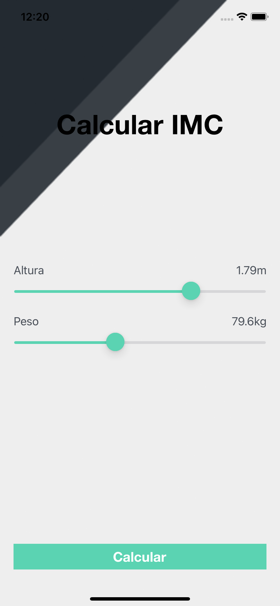
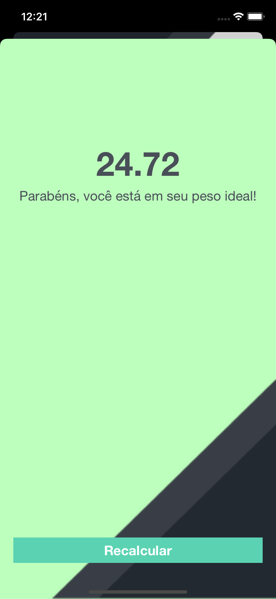
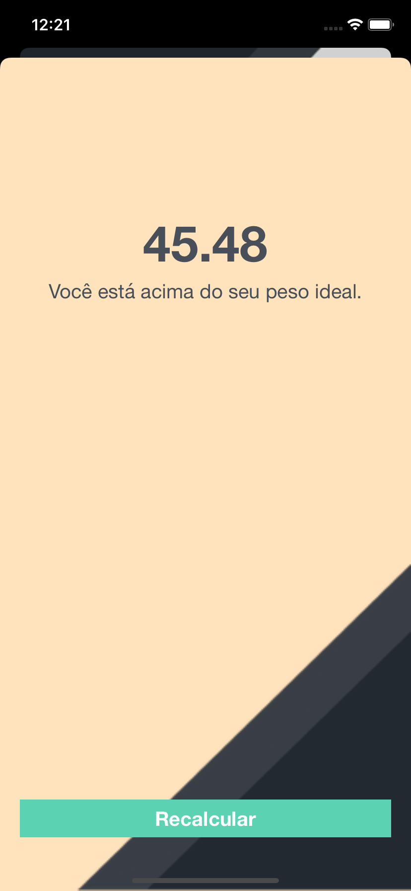

# IMC Calculator iOS App

App developed to practice some iOS development concepts:
  - AutoLayout: StackViews, alignment and constraints.
  - Struct
  - Optional operators
  - MVC Design Pattern
  - UIStoryboardSegue
  

